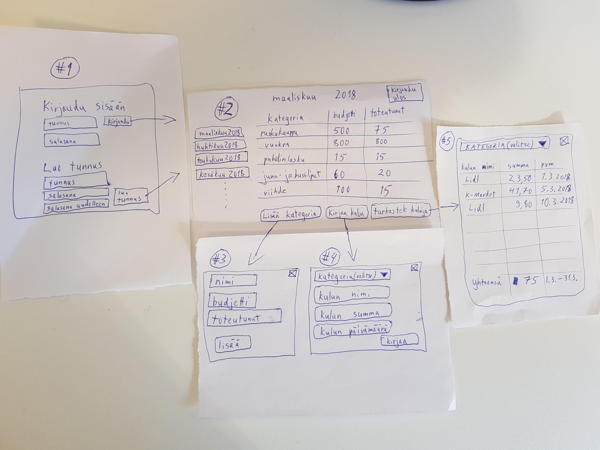

# Vaatimusmäärittely

## Sovelluksen tarkoitus

Sovelluksen tarkoitus on toimia budjettisovelluksena, eli auttaa käyttäjiä kuukausittaisessa budjetoinnissa. Tarkka toiminnallisuus tulee tarkentumaan kurssin ja harjoitustyön edetessä. Sovellusta voi käyttää useampi rekisteröitynyt käyttäjä, joilla kaikilla on oma erillinen budjettinäkymänsä. Sovelluksen käyttö edellyttää käyttäjätunnuksen luomista ja sisäänkirjautumista. Sovellusta voidaan tarvittaessa laajentaa myöhemmin esimerkiksi vuosittaiseen budjetointiin tai säästämisen ja sijoitusten koordinointiin. 

## Käyttäjät

Tässä vaiheessa (alussa) sovelluksella tulee olemaan vain yhdenlaisia käyttäjärooleja, eli _normaali käyttäjä_. _pääkäyttäjä_-tyylisen roolin lisääminen on mahdollista myöhemmin.

## Käyttöliittymäluonnos

Sovellus koostuu alustavasti viidestä eri näkymästä

Sovellus aukeaa kirjautumisnäkymään (näkymä #1), josta on suoraan mahdollista joko a) kirjautua sovellukseen tai b) luoda käyttäjätunnus ja kirjautua onnistuneen käyttäjätunnuksen luonnin yhteydessä sovelluksen kuukausinäkymään (näkymä #2).

## Kysymyksiä käyttöliittymään liittyen

Avoimia jo tunnistettuja kysymyksiä ovat ainakin:

1. millainen virheilmoitusnäkymä toteutetaan, jos kirjautumisessa tai tunnuksen luonnissa menee jokin pieleen
2. miten uuden kuukausiraportin luominen toteutetaan, ja
3. voiko raporttipohjia kopioida seuraavalle kuukaudelle vai ei, ja jos voi, niin miten
4. voiko kulukategorioita poistaa, voiko kuukausiraportteja poistaa, voiko yksittäisiä kuluja poistaa?
5. voiko uuden kulukategorian luoda uuden kulutapahtuman luonnin (näkymä #4) yhteydessä, vaiko pelkästään omassa kulukategorian luontiin keskittyvässä näkymässä (näkymä #3)?

## Perusversion tarjoama toiminnallisuus

### Ennen kirjautumista

- käyttäjä voi luoda järjestelmään käyttäjätunnuksen
  - käyttäjätunnuksen täytyy olla uniikki ja pituudeltaan vähintään 6 merkkiä
  - salasanan täytyy olla vähintään 8 merkkiä ja sisältää isoja ja pieniä kirjaimia sekä numeroita

- käyttäjä voi kirjautua järjestelmään
  - kirjautuminen onnistuu syötettäessä olemassaoleva käyttäjätunnus ja salasana kirjautumislomakkeelle
  - jos käyttäjää ei olemassa, ilmoittaa järjestelmä tästä

### Kirjautumisen jälkeen

- käyttäjä näkee uusimman budjettinsa kuukausinäkymän (näkymä #2)

- käyttäjä voi tarkastella myös vanhempien kuukausiensa näkymiä (näkymä #2)

- käyttäjä voi luoda uuden kulukategorian (näkymä #3)

- käyttäjä voi kirjata kulutapahtuman (näkymä #4)

- käyttäjä voi tarkastella kuukausiraporttinsa kuluja myös kategorian sisäisellä, yksittäiset kulutapahtumat sisältävällä tasolla (näkymä #5)

- käyttäjä voi kirjautua ulos järjestelmästä (näkymä #2)

## Jatkokehitysideoita

Perusversion jälkeen järjestelmää täydennetään ajan salliessa esim. seuraavilla toiminnallisuuksilla

- _pääkäyttäjä_-tyylisen käyttäjäroolin luominen ja rooliin liittyvät toiminnallisuudet
- kuluraporttien visualisointi erilaisiksi kaavioiksi
- kuluraporttien vienti ulkoisiksi tiedostoiksi (esim. csv tai pdf)
- kuluraporttien poisto
- käyttäjätunnuksen poisto
- kulukategorian luonti myös kulutapahtuman luonnin yhteydessä (näkymässä #5)
- kulujen kirjaus eri tasoilla (esim. ruokakauppaostosten kirjaus kuitin loppusumman tasolla vs. yksittäisten tuoterivien tasolla)
